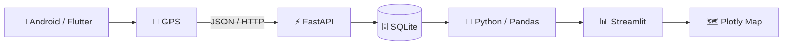

# 📡 TelemetryPulse AI

<div align="center">

### Real-Time Mobile Telemetry & Fleet Intelligence Command Center

**Flutter • FastAPI • Python • SQLite • Streamlit • Plotly • GPS**

Sistema completo de telemetria móvel capaz de coletar dados de localização de um dispositivo Android, transmitir os dados para uma API e apresentar métricas operacionais em um dashboard em tempo real.

</div>

---

## 🚀 Sobre o projeto

O **TelemetryPulse AI** é uma plataforma de telemetria desenvolvida para demonstrar um fluxo completo de captura, transmissão, armazenamento, processamento e visualização de dados de localização.

O dispositivo móvel coleta informações de GPS e transmite os dados para uma API desenvolvida em **FastAPI**.

Os registros são armazenados em um banco **SQLite** e processados em Python para alimentar um **Command Center** desenvolvido com Streamlit e Plotly.

O objetivo do projeto é simular uma arquitetura utilizada em soluções de:

- 🚚 Gestão de frotas
- 📍 Rastreamento GPS
- 🛰️ Telemetria de dispositivos
- 📊 Monitoramento operacional
- 🚗 Logística e mobilidade
- 🏢 Centros de Operações
- 📈 Análise de dados em tempo real

---

# 🧠 Arquitetura

```text
┌──────────────────────────┐
│      ANDROID DEVICE      │
│                          │
│  Flutter Mobile Tracker  │
│  GPS / Geolocation       │
└────────────┬─────────────┘
             │
             │ HTTP / JSON
             ▼
┌──────────────────────────┐
│        FASTAPI API       │
│                          │
│  POST /telemetry         │
│  GET  /telemetry/latest  │
│  GET  /telemetry/history │
│  GET  /health            │
└────────────┬─────────────┘
             │
             ▼
┌──────────────────────────┐
│          SQLite          │
│                          │
│   telemetry database     │
└────────────┬─────────────┘
             │
             ▼
┌──────────────────────────┐
│     DATA PROCESSING      │
│                          │
│ Python + Pandas          │
│ GPS calculations         │
│ Operational metrics      │
└────────────┬─────────────┘
             │
             ▼
┌──────────────────────────┐
│ TELEMETRYPULSE COMMAND   │
│          CENTER          │
│                          │
│ Streamlit + Plotly       │
│ Live Map + KPIs          │
└──────────────────────────┘
```

---

# ✨ Funcionalidades

### 📱 Mobile Telemetry

O aplicativo móvel realiza a coleta dos dados do dispositivo:

- Latitude
- Longitude
- Altitude
- Precisão do GPS
- Velocidade
- Direção
- Identificação do dispositivo
- Data/hora da leitura

Os dados são enviados para o backend através de requisições HTTP em formato JSON.

---

### ⚡ API de Telemetria

Backend construído com **FastAPI**, responsável pelo recebimento e consulta das informações.

Endpoints principais:

```http
GET /
GET /health

POST /telemetry

GET /telemetry/latest
GET /telemetry/history
```

Exemplo de payload:

```json
{
  "device_id": "mobile-device-01",
  "latitude": -15.797792,
  "longitude": -48.161387,
  "accuracy": 5.0,
  "speed": 2.5,
  "altitude": 1170.0,
  "heading": 90.0,
  "recorded_at": "2026-08-19T22:40:00Z"
}
```

---

# 🖥️ TelemetryPulse Command Center

O dashboard funciona como um **Centro de Controle Operacional**, permitindo acompanhar a telemetria recebida.

### Principais indicadores

| Indicador | Descrição |
|---|---|
| 🟢 Status | Identifica se o dispositivo está transmitindo |
| 🚗 Velocidade atual | Última velocidade registrada |
| 📊 Velocidade média | Média calculada da sessão |
| ⚡ Velocidade máxima | Maior velocidade registrada |
| 🛣️ Distância | Distância acumulada do trajeto |
| 🎯 Precisão GPS | Precisão da última leitura |
| 📍 Latitude / Longitude | Localização atual |
| ⛰️ Altitude | Altitude informada pelo dispositivo |
| 🧭 Direção | Heading do dispositivo |
| 📡 Último sinal | Tempo desde a última telemetria |

---

# 🗺️ Rastreamento em mapa

O Command Center apresenta:

- posição atual do dispositivo;
- histórico das posições;
- rota percorrida;
- atualização automática;
- identificação visual da posição atual;
- informações geográficas do dispositivo.

A distância percorrida é calculada a partir das coordenadas GPS utilizando a fórmula de **Haversine**.

---

# 📊 Analytics

Além do mapa, o dashboard realiza processamento das informações coletadas.

Entre as análises disponíveis estão:

```text
Velocidade atual
      ↓
Velocidade média
      ↓
Velocidade máxima
      ↓
Distância acumulada
      ↓
Precisão do GPS
      ↓
Histórico temporal
```

Os gráficos são construídos utilizando **Plotly**.

---

# 🛠️ Stack tecnológica

### Backend


### Data & Dashboard


### Mobile


---

# 📁 Estrutura do projeto

```text
telemetryPulseIA/
│
├── api/
│   └── main.py
│
├── app/
│   └── dashboard.py
│
├── database/
│   └── db.py
│
├── web/
│   └── tracker.html
│
├── requirements.txt
├── .gitignore
└── README.md
```

O banco local de telemetria não é versionado no Git para evitar a publicação de dados coletados durante os testes.

---

# ⚙️ Instalação

Clone o projeto:

```bash
git clone https://github.com/Gezeer/telemetryPulseIA.git
cd telemetryPulseIA
```

Crie o ambiente virtual:

```bash
python3 -m venv .venv
source .venv/bin/activate
```

Instale as dependências:

```bash
pip install -r requirements.txt
```

---

# 🚀 Executando a API

```bash
python -m uvicorn api.main:app --host 0.0.0.0 --port 8000
```

Verifique:

```text
http://127.0.0.1:8000/health
```

Resposta esperada:

```json
{
  "status": "healthy"
}
```

A documentação interativa da API fica disponível em:

```text
http://127.0.0.1:8000/docs
```

---

# 📊 Executando o Command Center

Em outro terminal:

```bash
source .venv/bin/activate
streamlit run app/dashboard.py
```

O dashboard ficará disponível normalmente em:

```text
http://localhost:8501
```

---

# 🔄 Pipeline de dados



---

# 🔐 Segurança e privacidade

Arquivos locais e dados de execução não são enviados ao repositório.

O `.gitignore` impede o versionamento de itens como:

```text
.venv/
*.db
*.sqlite
*.sqlite3
*.log
*_backup.py
*backup*.py
*backup*.html
.vscode/
.idea/
```

Isso evita publicar banco de telemetria, ambientes virtuais, arquivos temporários e backups de desenvolvimento.

---

# 🧪 Teste da API

Exemplo de envio manual de telemetria:

```bash
curl -X POST http://127.0.0.1:8000/telemetry \
  -H "Content-Type: application/json" \
  -d '{
    "device_id":"teste-manual",
    "latitude":-15.797792,
    "longitude":-48.161387,
    "accuracy":5.0,
    "speed":2.5,
    "altitude":1170.0,
    "heading":90.0,
    "recorded_at":"2026-08-19T22:40:00Z"
  }'
```

---

# 🧩 Conceitos aplicados

Este projeto demonstra conhecimentos em:

- Engenharia de Dados
- APIs REST
- Python
- FastAPI
- SQL
- SQLite
- Pandas
- Flutter
- Dart
- Integração Mobile ↔ Backend
- GPS e Geolocalização
- Processamento de telemetria
- Visualização de dados
- Dashboards operacionais
- Séries temporais
- Arquitetura cliente-servidor
- Monitoramento em tempo real

---

# 🔮 Roadmap

Próximas evoluções planejadas:

- [ ] Autenticação de dispositivos
- [ ] PostgreSQL
- [ ] WebSockets para streaming em tempo real
- [ ] Deploy em cloud
- [ ] Docker
- [ ] Histórico por dispositivo
- [ ] Gestão de múltiplos veículos
- [ ] Alertas operacionais
- [ ] Geofencing
- [ ] Detecção de anomalias
- [ ] Analytics com Inteligência Artificial
- [ ] Predição de rotas e comportamento
- [ ] Aplicativo mobile integrado ao monorepo

---

# 💡 Visão do projeto

O **TelemetryPulse AI** nasceu como um projeto prático para explorar a integração entre **desenvolvimento mobile, engenharia de dados, APIs, geolocalização e visualização operacional**.

Mais do que exibir coordenadas em um mapa, a proposta é construir a base de uma plataforma capaz de transformar telemetria bruta em **informação operacional e inteligência para tomada de decisão**.

---

<div align="center">

## 📡 TelemetryPulse AI

**From Mobile Data to Operational Intelligence**

Python • FastAPI • Flutter • SQLite • Streamlit • Plotly

⭐ Se este projeto foi útil ou interessante, considere deixar uma estrela no repositório.

</div>
